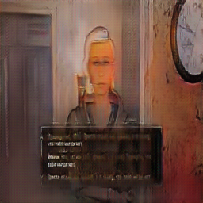
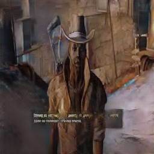
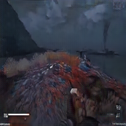

# retro_game_to_modern

## Задание

Натренировать CycleGAN для какой-нибудь задачи трансфера стиля. Например, "осовременить" кадры из старой компьютерной игры.

## Описание
Проект по обучению генеративной нейросети CycleGAN, которая преобразует кадры из компьютерной игры **Fallout 3** (F3) в **Fallout 4** (F4).
Fallout 3 | Fallout 4
------------ | -------------
| 

*Датасет доступен по ссылке:* https://disk.yandex.ru/d/QuHXILnuMZKM6A

*Чекпоинты доступны по ссылке:*  https://disk.yandex.ru/d/zw4ehbI46gsOww

## Подготовка

За основу был взят репозиторий [CycleGAN and pix2pix in PyTorch](https://github.com/junyanz/pytorch-CycleGAN-and-pix2pix) с PyTorch имплементацией CycleGAN. Этот репозиторий был подключен как сабмодуль, поэтому сначала необходимо выполнить:

```
git submodule init
git submodule update
```

Далее установить зависимости

```
cd pytorch-CycleGAN-and-pix2pix
pip install requirements.txt
```

### Датасет

Датасет был сформирован из нескольких видео по прохождению игр F3 и F4 ([пример F3](https://www.youtube.com/watch?v=p1p0gW3dfSU&list=PL8BD6rTh6z29m3sttrsHttYYY-xmKsztn&index=2), [пример F4](https://www.youtube.com/watch?v=yt8igSr0qik&t=1s)). Причем видео по F4 брались с улучшенной графикой.

- Объем изображений F3 составил - 1888.
- Объем изображений F4 составил - 2331.

Объемы изображений были перемешаны и разбиты на обучающую и тестовую выборки в соотношении 80% к 20%.

Датасет был сформирован в таком же формате хранения, который представлен в сабмодуле:

* retroGameToModern/
    * testA/ - тестовая выборка F3
    * trainA/  - обучающая выборка F3
    * testB/  - тестовая выборка F3
    * trainB/  - обучающая выборка F4

Далее датасет был помещен в папку **pytorch-CycleGAN-and-pix2pix/datasets/**

### Обучение
Для обучения была запущена команда 

```
python train.py --dataroot ./datasets/retroGameToModern/ --name retro_to_modern --model cycle_gan
```

Обучение выполнялось на GPU Nvidia RTX 3080. Время затраченное на одну эпоху обучения составило ~ 300 сек. Всего эпох 200.

Каждые 5 эпох выполнялось сохранение весов в папку *checkpoints/retro_to_modern/*

### Результаты

График обучения:


Команда для тестирования нейросети:

```
python test.py --dataroot datasets/retroGameToModern/testA --name retro_to_modern_latest --model test --no_dropout
```

Далее в таблице представлены несколько изображений из тестовой выборке обработанные нейросетью на разных эпохах обучения.

 | |  |  |  |  |  | | | |
--- | --- | --- | --- | --- | --- | ---|  --- |  ---
 Real |  |  |  |  |  |  |  | 
 25 |  |  |  |  |  |  |  | 
 50 |  |  |  |  |  |  |  | 
 75 |  |  |  |  |  |  |  | 
 100 |  |  |  |  |  |  |  | 
 125 |  |  |  |  |  |  |  | 
 150 |  |  |  |  |  |  |  | 
 175 |  |  |  |  |  |  |  | 
 200 |  |  |  |  |  |  |  | 

 В итоге на 100 эпохе обучения нейросеть показывает лучшее качество.

Оригинал F3 | Обработанный F3 на 100-й эпохе
------------ | -------------
| 
